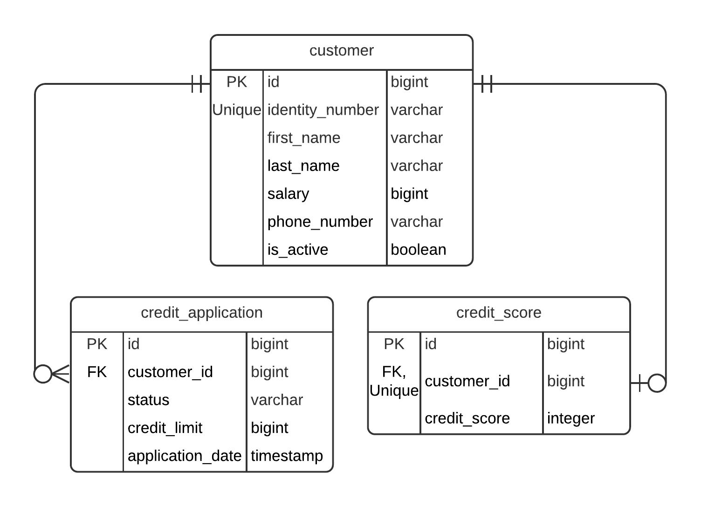
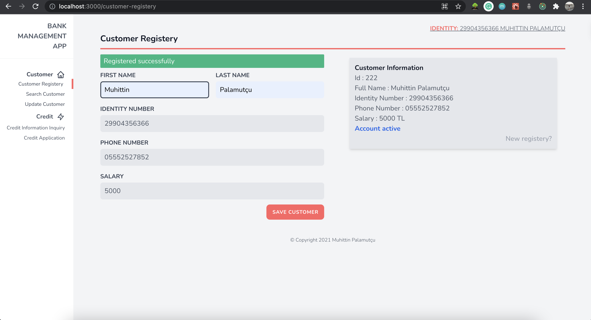
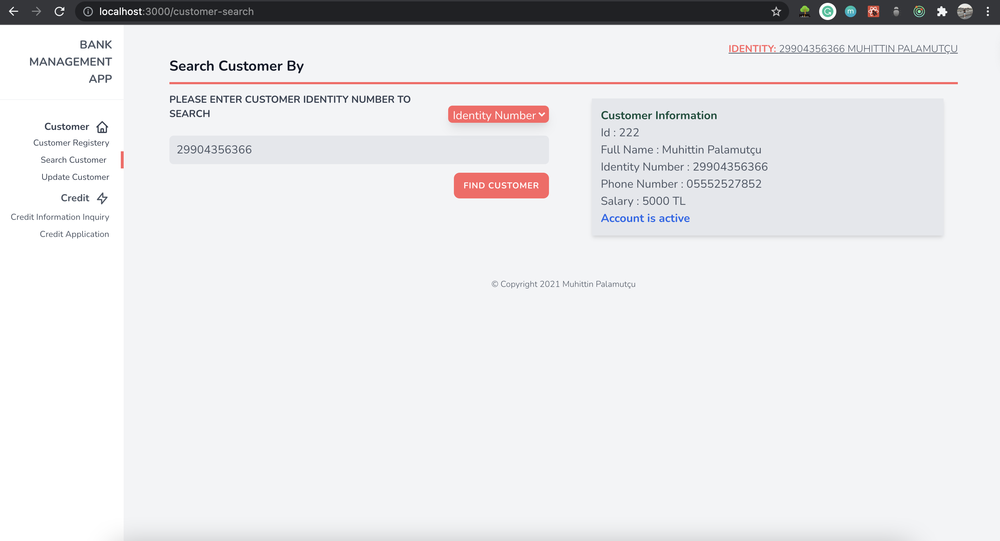
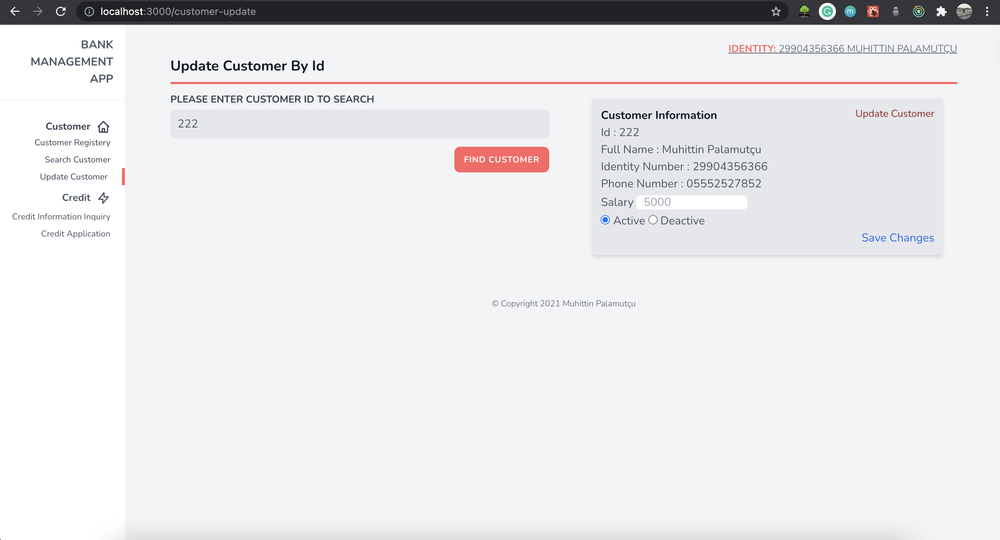
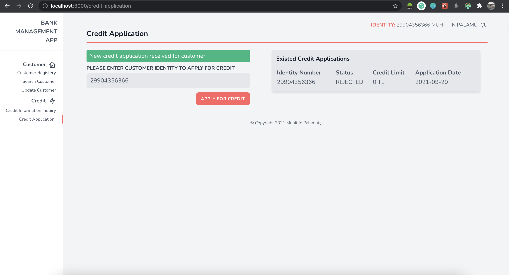
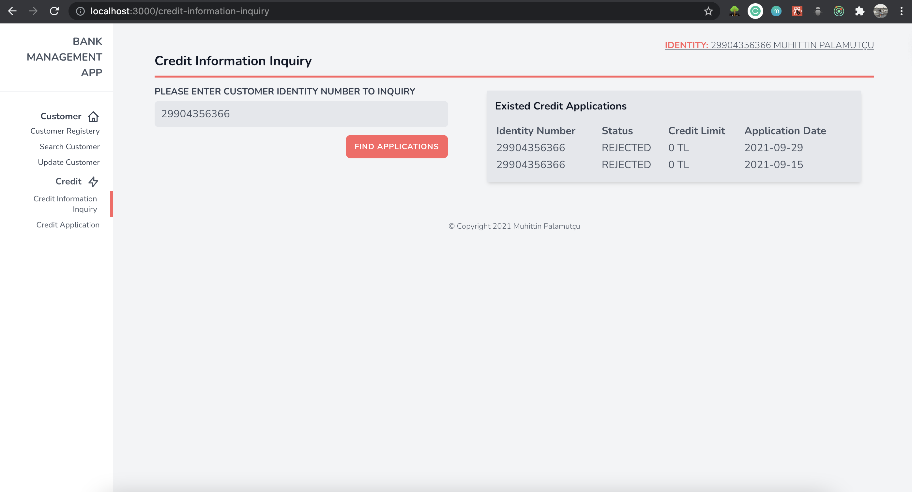

# Ödev Son Teslim Tarihi : 29 Eylül - Saat: 23:00

Project Requirements:
https://github.com/113-GittiGidiyor-Java-Spring-Bootcamp/gittigidiyor-graduation-project-muhittinpalamutcu/blob/main/Java_Spring_Bootcamp_Proje_Gorevi.pdf

## Tech Stack

#### <u>Backend</u>
- Java 11
- Spring Boot
- Docker
- PostgreSQL

#### <u>Frontend</u>
- React.js
- Npm
- Redux
- Tailwind CSS

## Pre-requisites

#### <u>Backend</u>
- Java 11+
- Docker
- Maven

#### <u>Frontend</u>
- Node.js
- Npm

## Database ER Diagram


### Start Database
Database is running on Docker container and defined in docker-compose.yml file, which can be start up with following command;
```
docker-compose up -d
```

### Run tests
```
cd bank-management-app
mvn test
```

### Start backend application
Firstly, make sure database is started.
Then;
```
cd bank-management-app
mvn spring-boot:run
```
Application will start on port 8080 by default.

### Swagger Page
http://localhost:8080/swagger-ui.html

### Containerization with Dockerfile for backend
```
cd bank-management-app
docker build --tag=bank-management-app:latest .
```

### Install necessary frontend packages 
Please make sure you have Node and Npm already installed on your machine.
```
cd bank-management-frontend
npm install
```

### Start frontend application
After installing necessary frontend packages;
```
cd bank-management-frontend
npm run start
```
Application will start on port 3000 by default.

Please note that backend application should work on port 8080.
If not please change the port number in package.json file.

### APIs

* `GET /api/customers?identity=?`
API to get customer by identity number.

Returns `200 OK` if customer is found.

Returns `404 NOT FOUND` if customer is not found.

* `GET /api/customers/{id}`

API to get customer by id.

Returns `200 OK` if customer is found.

Returns `404 NOT FOUND` if customer is not found.

Example response;
```
{
  "id": 200,
  "identityNumber": "45918282500",
  "firstName": "Muhittin",
  "lastName": "Palamutçu",
  "salary": 1000,
  "phoneNumber": "05552555555",
  "creditApplications": [],
  "creditScore": 2000,
  "fullName": "Muhittin Palamutçu",
  "active": true
}
```

* `POST /api/customers`

API to save customer.

Returns `200 OK` if customer is saved.

Returns `400 BAD REQUEST` if input is not valid.

Accepts body;
```
{
  "id": 205,
  "identityNumber": "29904356302",
  "firstName": "John",
  "lastName": "Doe",
  "salary": 1200,
  "phoneNumber": "05555252525",
  "creditApplications": null,
  "creditScore": null,
  "fullName": "John Doe",
  "active": true
}
```

Example error message in case of 400 bad request;
```
{
  "status": 400,
  "message": "There is already a customer with identity: 29904356392",
  "timestamp": 1632941794900
}
```

* `PATCH /api/customers/{id}/salary`

API to update customer salary. Salary is accepted in body.

Returns `200 OK` if salary is updated.

Returns `400 BAD REQUEST` if input is not valid.

Returns `404 NOT FOUND` if customer is not found.

* `PATCH /api/customers/{id}/status`

API to update customer status. Status is accepted in body as boolean.

Returns `200 OK` if status is updated.

Returns `404 NOT FOUND` if customer is not found.

Returns `400 BAD REQUEST` if input is not valid.

Example error response in case of 400 bad request;

```
{
  "status": 400,
  "message": "Account with id: 194 is already activated",
  "timestamp": 1632942394762
}
```

* `GET /api/credit-applications?customerIdentityNumber=?`

API to get credit applications for customer.

Returns `200 OK` if customer is found.

Returns `404 NOT FOUND` if customer is not found.

Example response;

```
[
  {
    "id": 111,
    "status": "APPROVED",
    "creditLimit": 10000,
    "applicationDate": "2021-09-20T20:29:46.352364"
  },
  {
    "id": 120,
    "status": "APPROVED",
    "creditLimit": 10000,
    "applicationDate": "2021-09-29T10:19:36.549362"
  }
]
```

* `POST /api/credit-applications`

API to apply for a new credit. Identity number of customer should be in the body.

Returns `200 OK` if application is successful.

Returns `404 NOT FOUND` if customer is not found.

Returns `400 BAD REQUEST` if customer is already has an application on last 7 days or customer is deactivated.

Example response in case of 400 bad request;
```
{
  "status": 400,
  "message": "Can not proceed, there is an another application on 7 days",
  "timestamp": 1632942857569
}
```

Example response for status 200 OK;
```
{
  "id": 112,
  "status": "REJECTED",
  "creditLimit": 0,
  "applicationDate": "2021-09-29T21:16:14.556092"
}
```

## Frontend screenshots

* Customer registry



* Customer search



* Customer update



* Credit application



* Credit Info



