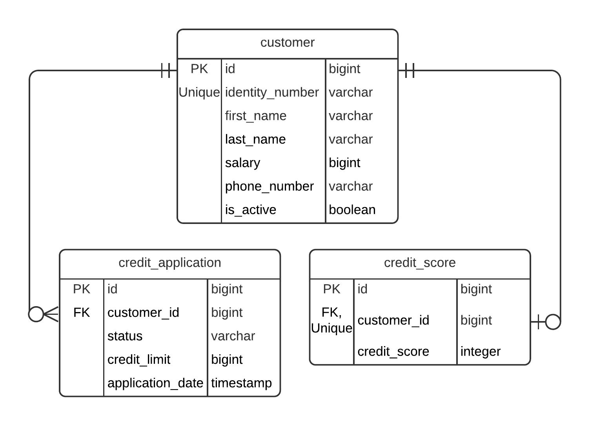

# Ödev Son Teslim Tarihi : 29 Eylül - Saat: 23:00

Project Requirements:
https://github.com/113-GittiGidiyor-Java-Spring-Bootcamp/gittigidiyor-graduation-project-muhittinpalamutcu/blob/main/Java_Spring_Bootcamp_Proje_Gorevi.pdf

## Tech Stack

- Java 11
- Spring Boot
- Docker
- PostgreSQL

## Pre-requisites

- Java 11+
- Docker
- Maven

## ER Diagram


### Start Database
Database is running on Docker container and defined in docker-compose.yml file, which can be start up with following command;
```
docker-compose up -d
```

### Run tests
```
cd bank-management-app
mvn test
```

### Start application
Firstly, make sure database is started.
Then;
```
cd bank-management-app
mvn spring-boot:run
```
Application will start on port 8080 by default.

### Swagger Page
http://localhost:8080/swagger-ui.html

### Containerization with Dockerfile
```
cd bank-management-app
docker build --tag=bank-management-app:latest .
```